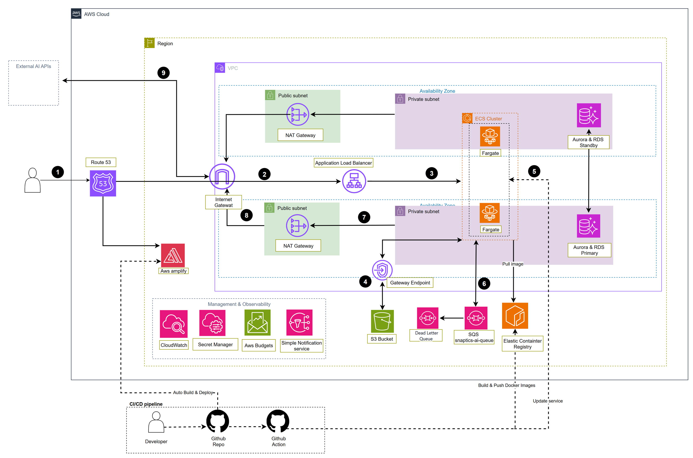

# Snaptics API

Backend for **Snaptics**, an AI-assisted income and expense tracker. The application combines receipt extraction, transaction categorization, personal and shared budgets, and financial insights with an Angular client.

**Project team:** 4 members · **Role of Dat Nguyen:** Full-stack Developer · **Development:** May–August 2026

[Frontend repository](https://github.com/DatNguyenSE/Snaptics-Client) · [AWS architecture](#aws-architecture) · [Local setup](#local-setup) · [Deployment](#deployment)

## Features

- **Income and expenses:** transactions, transaction details, categories, income sources, and financial dashboards.
- **Budgets:** personal and shared budgets, membership, deposits, and recurring budget rollover.
- **AI-assisted entry:** extract receipt fields with Azure Document Intelligence and categorize items with Gemini; analyze item images and support conversational transaction entry.
- **Asynchronous processing:** upload images to S3, queue analysis in SQS, and deliver results to the client through SignalR.
- **Accounts:** ASP.NET Core Identity, JWT authentication, roles, and email verification.
- **Background jobs:** Hangfire schedules item reviews, monthly AI insights, notification cleanup, and budget rollover.
- **Administration:** user management, categories, support tickets, and maintenance controls.

## Technology stack

| Area | Technologies |
| --- | --- |
| API | C#, .NET 10, ASP.NET Core Web API, Swagger/OpenAPI |
| Data access | Entity Framework Core, LINQ, SQL Server, repositories, Unit of Work |
| Authentication | ASP.NET Core Identity, JWT bearer authentication |
| AI | Gemini API, Azure Document Intelligence |
| Background work | AWS SQS, Hangfire |
| Real-time communication | ASP.NET Core SignalR |
| Storage and configuration | Amazon S3, Systems Manager Parameter Store |
| Delivery | Docker, GitHub Actions, Amazon ECR, ECS Fargate |
| Companion frontend | Angular 20, TypeScript, RxJS, Tailwind CSS |

## Application structure

The solution separates HTTP endpoints, business logic, and persistence into three projects:

```text
Snaptics-API/
├── API/                 Controllers, middleware, SignalR hub, SQS consumer
├── BLL/                 Services, business rules, AI integrations, DTOs
├── DAL/                 EF Core context, entities, repositories, migrations
├── docs/                AWS diagram and editable draw.io source
├── .github/workflows/   Backend deployment pipeline
├── Dockerfile           Multi-stage .NET container build
└── Snaptics-API.slnx     Solution
```

The API references BLL, and BLL references DAL. Business services use repository interfaces and a Unit of Work for persistence.

### Receipt processing

1. An authenticated client submits an image to `POST /ai/read-bill` or `POST /ai/analyze-image`.
2. The API stores the file in S3, sends a task to `snaptics-ai-queue`, and returns **HTTP 202 Accepted**.
3. The hosted SQS consumer downloads the image and invokes the relevant AI service.
4. Receipt extraction uses Azure Document Intelligence. Item categorization first tries a local dictionary, then Gemini for unresolved items.
5. The worker sends `ReceiveAiResult` or `ReceiveAiError` to the user through `/hubs/notification`.

### Implemented optimizations

- **Dictionary-first classification:** normalized keyword matching and Levenshtein-based fuzzy matching precede LLM fallback.
- **In-memory cache:** the classification dictionary has a maximum cache lifetime of 30 minutes and is invalidated when dictionary data changes.
- **Batched AI fallback:** duplicate item names are removed and unresolved names are sent in one classification request per receipt. No fallback request is needed when all items match the dictionary.
- **Smaller classification payloads:** the fallback sends item names rather than full receipt objects.
- **Background processing:** SQS moves receipt and image analysis out of the initial HTTP request; SignalR delivers completion events.
- **Read-only queries:** selected repository queries use EF Core `AsNoTracking`.

These are implementation details, not benchmark results. The repository does not include measured latency, throughput, or cost-reduction claims.

## AWS architecture



[Open full-size diagram](docs/aws-architecture.png) · [Download editable draw.io source](docs/aws-architecture.drawio)

| Component | Responsibility |
| --- | --- |
| Route 53 | DNS for application endpoints |
| AWS Amplify | Git-connected frontend builds and hosting |
| Application Load Balancer | Routes API traffic to ECS tasks |
| ECS Fargate | Runs the containerized backend in private subnets |
| VPC, subnets, NAT gateways | Network isolation and outbound access to external AI services |
| RDS | Relational database hosting; the application uses SQL Server |
| S3 and gateway endpoint | Receipt/image storage and private S3 access |
| SQS | AI task queue; redrive/DLQ settings are infrastructure configuration |
| ECR | Container image registry |
| Parameter Store | Runtime configuration under `/Snaptics/Production/` |
| CloudWatch, SNS, AWS Budgets | Deployment observability, notifications, and cost monitoring |

**Diagram scope:** the supplied diagram documents the infrastructure topology and is preserved as provided. Its “Aurora & RDS” label is generic; this code uses the SQL Server provider, not Aurora. It also shows “Secret Manager,” while the application currently loads secrets/configuration through **Systems Manager Parameter Store**. The repository does not provision the illustrated multi-AZ topology, monitoring policies, or DLQ through infrastructure-as-code.

## Local setup

Commands below use **PowerShell** and run from the repository root.

### 1. Prerequisites

- .NET SDK **10.0** and Git.
- A reachable development **SQL Server** instance. Hangfire uses the same configured connection.
- EF Core CLI **10.0.x** (`10.0.8` matches the API design package).
- For integrated features: a development AWS account/profile, an S3 bucket, an SQS queue named `snaptics-ai-queue`, Gemini access, Azure Document Intelligence, and SMTP credentials.
- Docker and AWS CLI are needed only for container builds/deployment or AWS CLI setup.

There is no self-contained offline integration mode: the SQS worker starts with the API and recurring Hangfire jobs are registered at startup. Configure development resources to exercise the complete application.

### 2. Clone and restore

```powershell
git clone https://github.com/DatNguyenSE/Snaptics-API.git
Set-Location Snaptics-API
dotnet restore Snaptics-API.slnx
```

If `dotnet ef --version` is unavailable, install the CLI:

```powershell
dotnet tool install --global dotnet-ef --version 10.0.8
```

### 3. Configure development settings

Create a local configuration file without overwriting an existing one:

```powershell
if (-not (Test-Path 'API/appsettings.Development.json')) {
    Copy-Item 'API/appsettings.example.json' 'API/appsettings.Development.json'
}
```

Edit `API/appsettings.Development.json` with your own development values. The example contains no working credentials. The development file is excluded from Git and the Docker build context.

| Setting | Purpose |
| --- | --- |
| `ConnectionStrings:DefaultConnection` | Development SQL Server connection |
| `TokenKey` | Random JWT signing secret; use at least 64 random bytes encoded as Base64 |
| `AiSettings:GeminiApiKey`, `GeminiModel`, `GeminiApiVersion` | Gemini credentials and a model available to your account |
| `AiSettings:AzureDocIntelEndpoint`, `AzureDocIntelKey` | Azure receipt extraction resource |
| `AWS:AccessKey`, `SecretKey`, `BucketName`, `Region` | Current S3 service configuration |
| `EmailSettings:Email`, `Password`, `Host`, `Port`, `DisplayName` | SMTP settings for verification emails |
| `AwsSns:TopicArn` | SNS topic for notification publishing |

For a temporary development JWT signing key in the current terminal:

```powershell
$env:TokenKey = [Convert]::ToBase64String(
    [System.Security.Cryptography.RandomNumberGenerator]::GetBytes(64)
)
$env:ASPNETCORE_ENVIRONMENT = 'Development'
```

A newly generated key invalidates tokens signed with the previous key. Store a stable development key in your ignored local configuration if needed.

**AWS credentials:** S3 currently reads explicit credentials from the `AWS` configuration section. SQS, SNS, and the Parameter Store provider use the AWS SDK credential chain, such as an AWS profile locally or an ECS task role in AWS. Configuring only the S3 keys does not configure those other clients.

**Current configuration behavior:** `Program.cs` attempts to load `/Snaptics/Production/` even in Development. If accessible, that provider can override local settings. Use a development AWS identity without access to production parameters, and verify that the effective database connection points to your development database before running migrations. A failed Parameter Store load is caught and local configuration remains available.

### 4. Apply migrations to the development database

```powershell
dotnet ef database update --project DAL --startup-project API -- --environment Development
```

The command changes the configured database. It does not provision a SQL Server instance or AWS resources.

**Administrator accounts:** historical migrations contain a legacy seeded administrator. The `StopManagingAdminSeed` migration stops EF from managing that account as model seed data and preserves existing records. It does not rotate its password, and replaying historical migrations on a new database can recreate the legacy account. Replace/reset legacy credentials through an authorized Identity administration flow before exposing a database. An automatic `AdminBootstrap` configuration flow is not implemented.

### 5. Run the API

```powershell
dotnet dev-certs https --trust
dotnet run --project API --launch-profile https
```

- API: `https://localhost:7176`
- Swagger UI: `https://localhost:7176/swagger` (Development only)
- SignalR hub: `https://localhost:7176/hubs/notification`

Registration and email verification require working SMTP configuration. Protected endpoints expect `Authorization: Bearer <token>`. Use Swagger to inspect current routes and request models.

For the Angular interface, follow the [client repository](https://github.com/DatNguyenSE/Snaptics-Client) and point its API configuration to this backend.

## Deployment

### Backend: GitHub Actions → ECR → ECS Fargate

The [deployment workflow](.github/workflows/deploy.yml) runs **manually only**, using `workflow_dispatch`. Pushing commits does not trigger a deployment.

AWS resources have been removed to reduce costs. Re-provision the required infrastructure before running the workflow. Once this workflow is on the default branch, open **Actions → Deploy Backend to Fargate → Run workflow**, select the deployment branch, and start the run.

The workflow then:

1. Authenticate to AWS using repository secrets `AWS_ACCESS_KEY_ID` and `AWS_SECRET_ACCESS_KEY`.
2. Build the Docker image and push the `latest` tag to ECR.
3. Force a new deployment of the configured ECS service.

Before running the workflow, provision the ECR repository, ECS cluster/service and task definition, database, network access, task permissions, and runtime configuration. Check the workflow's `AWS_REGION`, `ECR_REPOSITORY`, `ECS_SERVICE`, and `ECS_CLUSTER` values for your environment. The API container listens on port **8080**.

The workflow deploys application code; it does not create infrastructure, apply EF migrations, or run automated tests. Apply reviewed database migrations through your own release process.

### Frontend: AWS Amplify

The Angular frontend lives in the separate client repository. Configure its Git-connected build and hosting in Amplify, with the application root/build output matching the client's configuration. This API repository does not contain the Amplify build configuration.

### Configuration and operations

- Store production secrets as encrypted Parameter Store values under `/Snaptics/Production/`, matching the application configuration hierarchy. Grant the appropriate SSM/KMS access to the runtime identity.
- `API/appsettings.Production.json` contains configuration placeholders, not deploy-ready secrets.
- The diagram includes CloudWatch monitoring, but the current `Program.cs` does not register a CloudWatch Serilog sink. Configure the ECS task logging driver separately for container logs.
- Restrict access to the Hangfire dashboard and review production CORS settings before exposing a deployment; current startup code enables a permissive origin policy.
- `deploy.ps1` is an alternative manual deployment script with project-specific infrastructure names. Review those values before using it.

## Build verification

```powershell
dotnet build Snaptics-API.slnx
```

The repository currently has no dedicated backend test project. A successful build does not verify live AWS resources, external AI calls, email delivery, or deployment health.
