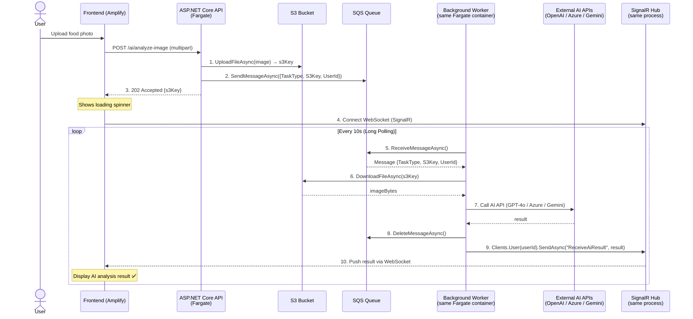

# Snaptics - System Architecture

```mermaid
flowchart TD
    %% ─────────────────────────────────────────
    %% EXTERNAL USERS & SERVICES
    %% ─────────────────────────────────────────
    USER(["👤 User\n(Browser / Mobile)"])

    subgraph EXT["☁️ External AI Services"]
        AZURE["🔵 Azure Document Intelligence\n(OCR / Read Bill)"]
        OPENAI["🟢 OpenAI GPT-4o Vision\n(Analyze Food Image)"]
        GEMINI["🔴 Google Gemini API\n(NLP Chatbot / JSON Extraction)"]
    end

    subgraph MAIL["📧 External Email"]
        SMTP["✉️ SMTP Mail Service\n(OTP / Notifications)"]
    end

    %% ─────────────────────────────────────────
    %% CI/CD PIPELINE
    %% ─────────────────────────────────────────
    subgraph CICD["🔧 CI/CD Pipeline"]
        direction LR
        DEV["👨‍💻 Developer"]
        GH["🐙 GitHub Repo"]
        GHA["⚙️ GitHub Actions\n(Auto Build & Deploy)"]
        ECR["📦 Amazon ECR\n(Docker Image Registry)"]

        DEV -->|"git push"| GH
        GH -->|"trigger workflow"| GHA
        GHA -->|"docker build & push"| ECR
    end

    %% ─────────────────────────────────────────
    %% AWS CLOUD
    %% ─────────────────────────────────────────
    subgraph AWS["☁️ AWS Cloud  (ap-southeast-1)"]

        %% DNS
        R53["🌐 Route 53\napi.snaptics.com → ALB\napp.snaptics.com → CloudFront"]

        %% Frontend
        subgraph FE["Frontend Layer"]
            CF["🚀 CloudFront CDN"]
            AMP["📱 AWS Amplify\n(Static Web - Angular/React)"]
            CF --> AMP
        end

        %% Security
        WAF["🛡️ AWS WAF\n- Block SQL Injection\n- Block XSS\n- Rate Limiting"]

        %% Load Balancer
        ALB["⚖️ Application Load Balancer\n- HTTPS :443\n- Sticky Session (SignalR)\n- Target Group → Fargate :5000\nSG: Allow 443 from 0.0.0.0/0"]

        %% VPC
        subgraph VPC["🔒 VPC  (10.0.0.0/16)"]

            subgraph PUB["Public Subnet (Multi-AZ)"]
                IGW["🌍 Internet Gateway"]
                NAT["🔀 NAT Gateway\n(Production only)\n💡 Dev: Fargate in Public\nto save $32/month"]
            end

            subgraph PRIV["Private Subnet (Multi-AZ)"]

                subgraph ECS["🐳 ECS Fargate Cluster"]
                    subgraph TASK["Fargate Task Container\n(ASP.NET Core Monolith)"]
                        API["🔌 ASP.NET Core API\n- REST Controllers\n- SignalR Hub (WebSocket)\n- JWT + Refresh Token Auth\n- OTP Email Verification"]
                        WORKER["⚙️ Background Worker\n(IHostedService)\n- SQS Consumer (Long Poll 10s)\n- Download from S3\n- Call AI APIs\n- Push SignalR result"]
                    end
                    SCALE["📈 Auto Scaling\nCPU > 75% → Scale Out"]
                end

                subgraph RDS_GROUP["🗄️ Amazon RDS"]
                    RDS_P["🗄️ RDS SQL Server\nPrimary (Single-AZ)\n- Port: 1433\n- Auto Backup daily\nSG: Allow 1433 from Fargate only"]
                    RDS_S["🗄️ RDS SQL Server\nStandby (Multi-AZ)\n📐 Design only\n💡 Dev: Disabled to save $35/month"]
                    RDS_P -.->|"Multi-AZ Sync\n(Production mode)"| RDS_S
                end

            end
        end

        %% Async Layer
        subgraph ASYNC["📨 Async Processing Layer"]
            SQS["📬 SQS Main Queue\nsnaptics-ai-queue\n- Visibility Timeout: 60s\n- Long Polling: 10s"]
            DLQ["☠️ SQS Dead Letter Queue\n- Max Receive: 3 retries\n- Retention: 14 days\n(Captures failed AI jobs)"]
            SQS -->|"After 3 failures"| DLQ
        end

        %% Storage
        subgraph STORAGE["🗃️ Storage Layer"]
            S3["🪣 S3 Bucket\nsnaptics-storage-bucket\n📁 temp-ai/  → AI input images\n📁 bills/    → Receipt uploads\n📁 avatars/  → Profile photos\n⏰ Lifecycle: delete temp-ai/* after 1 day"]
        end

        %% Security & Config
        subgraph SEC["🔐 Security & Config"]
            SSM["🔑 Parameter Store (SSM)\n- DB Connection String\n- OpenAI API Key\n- Azure API Key\n- Gemini API Key\n- JWT Secret"]
            IAM["🪪 IAM Task Role\n- S3: GetObject, PutObject\n- SQS: ReceiveMessage, DeleteMessage\n- SSM: GetParameter (read-only)"]
        end

        %% Observability
        subgraph OBS["📊 Monitoring & Observability"]
            CW["📋 CloudWatch\n- Fargate Logs (stdout/stderr)\n- Alarms: CPU, Memory, SQS Age\n- Metrics Dashboard"]
            BUDGET["💰 AWS Budgets\n- Alert if cost > $50/month"]
        end

    end

    %% ─────────────────────────────────────────
    %% CONNECTIONS
    %% ─────────────────────────────────────────

    %% User flow
    USER -->|"HTTPS"| R53
    R53 -->|"app.snaptics.com"| CF
    R53 -->|"api.snaptics.com"| WAF
    WAF --> ALB
    ALB -->|"Forward to Fargate :5000"| API
    USER <-->|"WebSocket (SignalR)\nReal-time AI results"| ALB

    %% CI/CD to ECS
    ECR -->|"Update ECS Service\n(Rolling Deploy)"| ECS

    %% API internals
    API -->|"1. Upload image"| S3
    API -->|"2. Publish message\n{TaskType, S3Key, UserId}"| SQS
    API -->|"Read/Write"| RDS_P
    API -->|"Send OTP email"| SMTP

    %% Worker flow
    SQS -->|"3. Poll (long polling)"| WORKER
    WORKER -->|"4. Download image"| S3
    WORKER -->|"5a. AnalyzeImage"| OPENAI
    WORKER -->|"5b. ReadBill"| AZURE
    WORKER -->|"5c. Chatbot"| GEMINI
    WORKER -->|"6. Save result"| RDS_P
    WORKER -->|"7. Push notification\nReceiveAiResult"| API

    %% Security
    IAM -.->|"grants permissions"| TASK
    SSM -.->|"injects secrets at startup"| TASK

    %% Observability
    TASK -.->|"logs"| CW
    ECS -.->|"metrics"| CW

    %% Networking
    IGW -.->|"outbound internet\n(Dev: Fargate direct)"| TASK
    NAT -.->|"outbound internet\n(Production: Fargate via NAT)"| TASK

    %% ─────────────────────────────────────────
    %% STYLES
    %% ─────────────────────────────────────────
    classDef aws fill:#FF9900,stroke:#232F3E,color:#232F3E,font-weight:bold
    classDef ext fill:#4285F4,stroke:#1a73e8,color:white,font-weight:bold
    classDef security fill:#DD344C,stroke:#b71c1c,color:white,font-weight:bold
    classDef compute fill:#ED7100,stroke:#BF5B00,color:white,font-weight:bold
    classDef storage fill:#3F8624,stroke:#2d6119,color:white,font-weight:bold
    classDef monitoring fill:#8C4FFF,stroke:#6B21A8,color:white,font-weight:bold
    classDef cicd fill:#24292F,stroke:#000,color:white,font-weight:bold

    class R53,ALB,CF,AMP,ECR,SSM,IAM,BUDGET aws
    class AZURE,OPENAI,GEMINI,SMTP ext
    class WAF,SEC security
    class API,WORKER,ECS,TASK compute
    class S3,RDS_P,RDS_S storage
    class CW,OBS monitoring
    class DEV,GH,GHA cicd
```

---

## 📋 Async Flow — Numbered Steps

---

## 🔐 Security Groups Summary

| Component | Inbound | Outbound |
|-----------|---------|----------|
| **ALB** | TCP 443 from `0.0.0.0/0` | TCP 5000 to Fargate SG |
| **Fargate** | TCP 5000 from ALB SG only | All (to reach S3, SQS, RDS, AI APIs) |
| **RDS** | TCP 1433 from Fargate SG only | None needed |

---

## 💰 FinOps: Design vs Actual Deployment

| Component | Enterprise Design | Actual (Student Budget) | Savings |
|-----------|------------------|------------------------|---------|
| **Networking** | Private Subnet + NAT Gateway | Public Subnet + Internet Gateway | ~$32/month |
| **Database** | RDS Multi-AZ (Primary + Standby) | RDS Single-AZ (Express) | ~$35/month |
| **Total saved** | | | **~$67/month** |

> **FinOps principle:** The architecture diagram represents production-grade design.
> Actual deployment applies environment-based cost optimization — a deliberate trade-off, not a gap.

---

## ⚠️ Known Limitations & Roadmap

| Issue | Impact | Future Fix |
|-------|--------|-----------|
| **Coupled Scaling** — API + Worker in same container | Cannot scale AI processing independently | Separate Worker into dedicated ECS Task |
| **SignalR Backplane** — No Redis sync between Fargate tasks | Signal lost if scaled to >1 task | Add ElastiCache Redis as SignalR backplane |
| **No Caching Layer** — Dashboard queries hit RDS every time | Higher DB load for stats queries | Add ElastiCache Redis for read-through cache |
